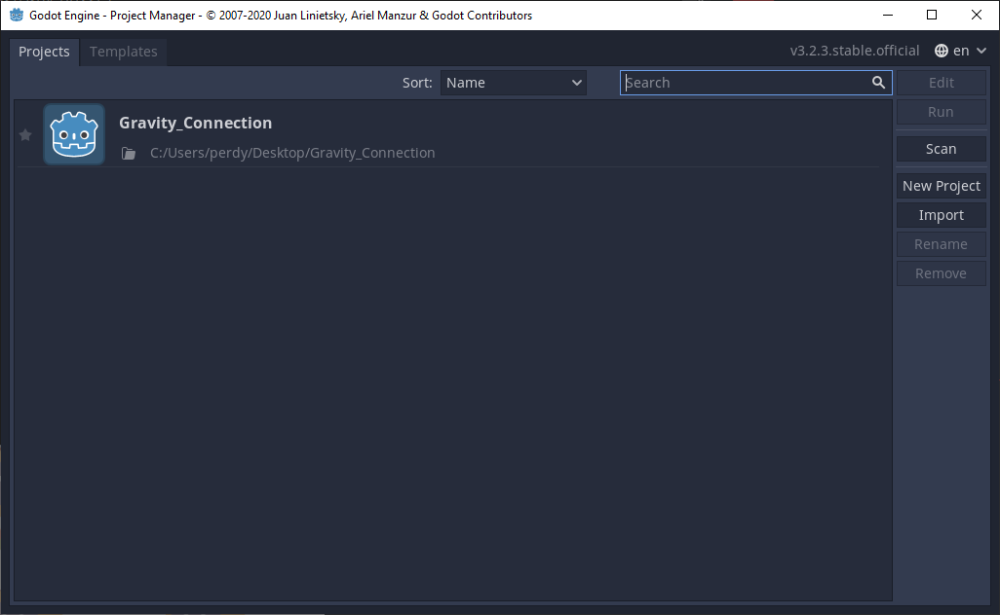
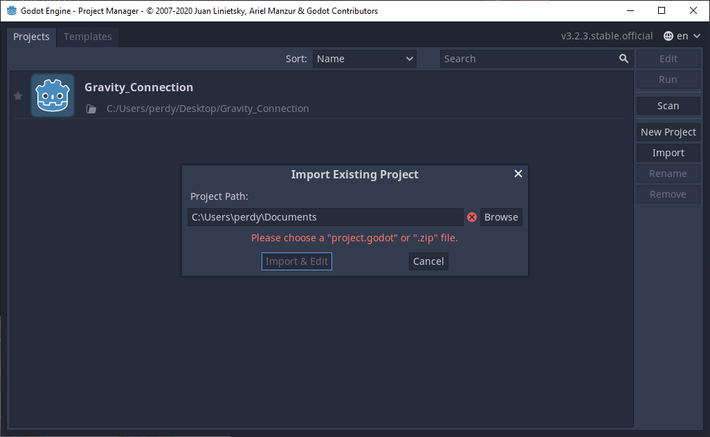
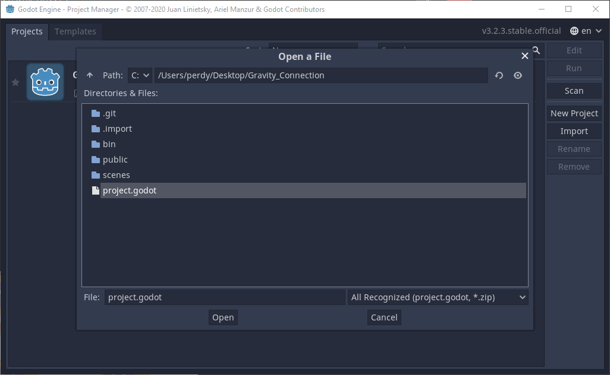
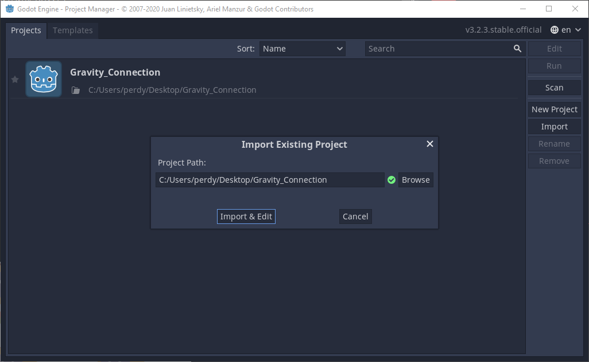
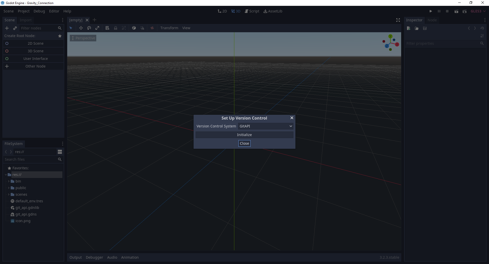
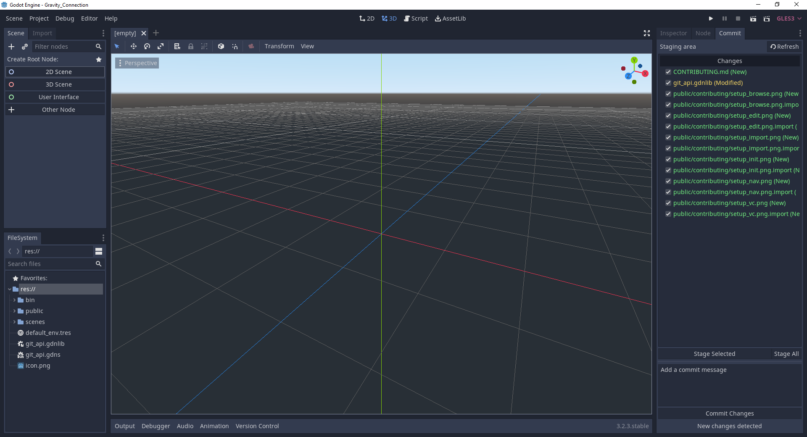

# Contributing

## Importing the project

Begin by cloning the repository.

`git clone https://github.com/gloryq/Gravity_Connection`

Click "Import" to import the project into the Godot engine.

Next, click "Browse" to browse to the location where the godot project was cloned.

Navigate to the location where the project is saved, click on the "project.godot" file, and click "Open."

Then, click "Import & Edit" to finish importing the project into the engine.

## Setting up source control (not required)

*Note: This project includes binaries for [godot-git-plugin](https://github.com/godotengine/godot-git-plugin) for utilizing git source control within the Godot engine. You must have the latest version of [the VC 2019 redistributable runtime](https://support.microsoft.com/en-us/topic/the-latest-supported-visual-c-downloads-2647da03-1eea-4433-9aff-95f26a218cc0), have git installed and your GitHub credentials must be set up for this to work. Please visit [https://git-scm.com/downloads](https://git-scm.com/downloads) for more information.*

Navigate to Project > Version Control and click "Set Up Version Control." Next, click "Initialize" to finish setting it up. When it is done, click "Close" to go back to the editor.

All done! You should now have a "Commit" tab on the right of your editor.

*Note: This process will need to be done each time you start the editor.*

## Issues

Issues can be submitted and resolved [here](https://github.com/gloryq/Gravity_Connection/issues)!